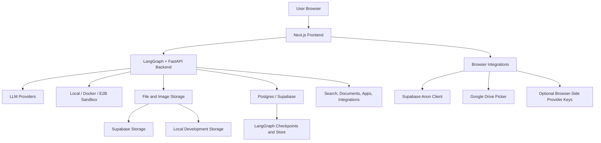

# Neloo Architecture

Neloo is a general-purpose AI agent workspace. It combines a Next.js frontend, a LangGraph backend, model-provider routing, tool execution, file/image storage, and optional cloud sandboxes.

The built-in LangGraph graph ID is still `data_analyst` for compatibility with older deployments and stored threads. Treat that as an internal identifier, not the product identity.

## System Overview

## Main Components

| Component | Path | Responsibility |
| --- | --- | --- |
| Frontend app | `frontend/` | Chat workspace, model selector, file/image surfaces, slides and resume tools, browser integrations. |
| Backend app | `backend/` | LangGraph graph, FastAPI routes, model registry, tools, sandbox execution, storage, persistence. |
| Local LangGraph config | `backend/langgraph.json` | Development config. Does not require `DATABASE_URL`. |
| Production LangGraph config | `backend/langgraph.production.json` | Postgres-backed checkpointer/store for durable production deployments. |
| Config assistant | `neloo-configurator/` | Optional setup helper for users and AI coding tools. Not loaded by the runtime agent. |
| Tool discovery wrappers | `.agents/skills/`, `.claude/skills/` | Thin entry points that point AI tools to `neloo-configurator/`. |
| Deployment files | `Dockerfile`, `backend/Dockerfile`, `backend/railway.toml` | Container deployment support. |

## Frontend Flow

1. The browser loads the Next.js app from `frontend/`.
2. `NEXT_PUBLIC_API_URL` points the app to the backend.
3. The model selector calls the backend model API and shows canonical public model entries.
4. Chat and tool events stream through the LangGraph client.
5. Optional browser integrations use public `NEXT_PUBLIC_*` values. These are visible in browser JavaScript and must use restricted keys in production.

## Backend Flow

1. LangGraph loads the built-in graph under the compatibility ID `data_analyst`.
2. The model registry builds provider entries from backend environment variables.
3. FastAPI routes handle files, images, threads, generated artifacts, health checks, and feature-specific APIs.
4. Tools can execute code, search the web, work with documents, and call configured integrations.
5. Sandbox execution runs locally for trusted development, in Docker for local isolation, or in E2B for cloud isolation.
6. Storage can use local files for development and Supabase/Postgres-backed services for production.

## Model Routing

The top-left model selector is driven by `backend/src/agent/graph.py` and backend environment variables. Neloo shows one canonical public entry per provider, such as DeepSeek, Qwen, Claude, OpenAI, Gemini, GLM, OpenRouter, and custom OpenAI/Anthropic-compatible endpoints.

Legacy graph IDs remain registered or normalized where needed so old stored thread values do not crash. New deployments should configure canonical provider variables documented in `docs/configuration.md`.

## Persistence

Local development:

- Uses `backend/langgraph.json`.
- Does not require `DATABASE_URL`.
- May lose thread history after backend restarts.

Production:

- Uses `backend/langgraph.production.json` or an equivalent startup path with a Postgres checkpointer.
- Requires `DATABASE_URL`.
- Can use Railway Postgres or Supabase Postgres.

## External Platforms

| Platform | Role |
| --- | --- |
| Supabase | Optional database, storage, auth/browser client, and migration target. |
| Railway | Recommended backend hosting and optional Postgres provider. |
| Vercel | Recommended frontend hosting. |
| E2B | Recommended cloud sandbox for untrusted code execution. |
| LLM providers | Chat model routing and feature-specific generation. |
| Tavily, Composio, LangSmith, Google Cloud | Optional search, app integration, tracing, and Drive Picker support. |

## Configuration Source Of Truth

Use these files first:

- `backend/.env.example`
- `frontend/.env.example`
- `docs/configuration.md`
- `neloo-configurator/references/configuration-map.md`

Never commit real `.env` files, service-role keys, database URLs, or unrestricted provider keys.
