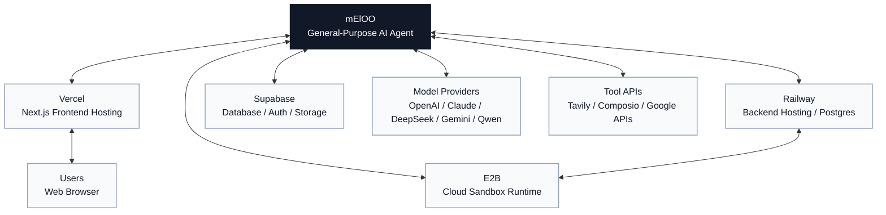

# Neloo

[English](./README.md) | [简体中文](./docs/readme/README.zh-CN.md) | [Español](./docs/readme/README.es.md) | [العربية](./docs/readme/README.ar.md) | [Bahasa Indonesia](./docs/readme/README.id.md) | [Português](./docs/readme/README.pt-BR.md)

Neloo is a general-purpose AI agent workspace built with a Next.js frontend and a LangGraph / Deep Agents backend. It is designed for chat-based task execution, tool use, file workflows, code execution, presentation generation, image workflows, resume utilities, and third-party app integrations.

The project started with a data-analysis focus, so a few internal graph IDs still use the historical name `data_analyst`. The product direction is now a general agent.

## Features

- General agent chat powered by LangGraph and Deep Agents.
- Multiple model providers through native and OpenAI-compatible APIs.
- Tool calling, sub-agents, human-in-the-loop hooks, and artifact rendering.
- File upload, generated-file downloads, and optional Supabase-backed storage.
- Code execution through E2B, Docker, or local subprocess mode.
- Web search through Tavily.
- Optional Composio integrations for third-party apps.
- Presentation, image, translation, and resume-related workflows.
- Anonymous local mode for development without a required login flow.

## Architecture

### Integration Map

Neloo sits at the center of several optional platform integrations. Configure only the services you need for your deployment.



```text
neloo/
├── backend/                 # Python backend, LangGraph app, API routes
│   ├── src/agent/           # Agent graph, model registry, prompts
│   ├── src/api/             # FastAPI routes used by the frontend
│   ├── src/sandbox/         # E2B, Docker, and local execution
│   ├── src/storage/         # Local/Supabase storage adapters
│   ├── supabase/migrations/ # Backend database migrations
│   ├── langgraph.json       # LangGraph configuration
│   └── .env.example         # Backend environment template
├── frontend/                # Next.js application
│   ├── src/app/             # App Router pages and feature experiences
│   ├── src/components/      # Shared UI components
│   ├── src/providers/       # App providers
│   └── .env.example         # Frontend environment template
├── e2b-template/            # Optional E2B template build project
├── supabase/migrations/     # Additional Supabase migrations
└── docs/readme/             # Translated README files
```

## Prerequisites

- Python 3.11+
- Node.js 20+
- Yarn 1.x or npm
- A model provider key, for example DeepSeek, Qwen, OpenRouter, Anthropic, OpenAI, MiniMax, Zhipu, NewAPI, or Tu-Zi
- Optional: Supabase project for persistence and storage
- Optional: E2B account for cloud sandbox execution
- Optional: Railway, Vercel, Tavily, Composio, LangSmith, and Google Cloud credentials depending on the features you enable

## Quick Start

### 1. Backend

```bash
cd backend
cp .env.example .env
python -m venv .venv
source .venv/bin/activate
pip install -e .
```

Edit `backend/.env` and set at least one model key. For local development, start with:

```env
SANDBOX_MODE=local
DEEPSEEK_API_KEY=your-key
```

Then run:

```bash
langgraph dev --host 127.0.0.1 --port 2024
```

### 2. Frontend

```bash
cd frontend
cp .env.example .env.local
yarn install
yarn dev
```

The app is available at [http://localhost:3000](http://localhost:3000). If port `3000` is already in use, run:

```bash
yarn next dev --turbopack --port 3001
```

## Environment Configuration

Use `backend/.env.example` and `frontend/.env.example` as the canonical templates. Do not commit real `.env` files.

For a complete step-by-step setup guide, including Supabase, Railway, E2B, chat model providers, image generation keys, and production deployment variables, see [docs/configuration.md](./docs/configuration.md).

Neloo also includes `neloo-configurator/`, a setup assistant for external AI coding tools. It is not loaded by the Neloo runtime agent. Codex/Copilot/Cursor-style tools can discover it through `.agents/skills/neloo-configurator/`, and Claude Code can discover it through `.claude/skills/neloo-configurator/`.

Manual configuration starts with:

```bash
cp backend/.env.example backend/.env
cp frontend/.env.example frontend/.env.local
```

### Backend

| Area | Variables | Notes |
| --- | --- | --- |
| Server | `PORT`, `API_BASE_URL`, `FRONTEND_URL`, `CORS_ALLOWED_ORIGINS` | Required for deployment URLs and browser access. |
| LangGraph | `LANGGRAPH_API_URL`, `LANGGRAPH_INTERNAL_URL`, `LANGGRAPH_DEFAULT_GRAPH_ID` | Default graph ID is currently `data_analyst`. |
| Model providers | `DEEPSEEK_API_KEY`, `QWEN_API_KEY`, `MINIMAX_API_KEY`, `ANTHROPIC_API_KEY`, `OPENROUTER_API_KEY`, `OPENAI_API_KEY`, `ZHIPU_API_KEY`, `NEWAPI_API_KEY`, `TUZI_API_KEY` | Configure one or more. Matching models appear in the UI. |
| Provider base URLs | `QWEN_BASE_URL`, `MINIMAX_BASE_URL`, `MINIMAX_ANTHROPIC_BASE_URL`, `ANTHROPIC_BASE_URL`, `OPENROUTER_BASE_URL`, `ZHIPU_BASE_URL`, `NEWAPI_BASE_URL`, `NEWAPI_ANTHROPIC_BASE_URL`, `TUZI_BASE_URL`, `TUZI_ANTHROPIC_BASE_URL` | Required for OpenAI-compatible or Anthropic-compatible gateways. |
| Sandbox | `SANDBOX_MODE`, `E2B_API_KEY` | Use `local` only for trusted local development. Use `e2b` or `docker` for stronger isolation. |
| Supabase | `SUPABASE_URL`, `SUPABASE_SERVICE_KEY`, `SUPABASE_JWT_SECRET`, `SUPABASE_DB_HOST`, `SUPABASE_DB_PASSWORD` | Service role keys are server-only secrets. |
| Persistence | `DATABASE_URL` | Railway Postgres normally provides this automatically. Required for durable LangGraph checkpoints. |
| Storage signing | `FILE_SECRET_KEY`, `IMAGE_SECRET_KEY`, `FILE_USE_LOCAL_STORAGE`, `IMAGE_USE_LOCAL_STORAGE` | Use stable random secrets in production. |
| Integrations | `TAVILY_API_KEY`, `COMPOSIO_API_KEY`, `LANGSMITH_API_KEY`, `LANGSMITH_TRACING_V2`, `LANGSMITH_PROJECT` | Optional feature-specific services. |

### Frontend

| Area | Variables | Notes |
| --- | --- | --- |
| Backend connection | `NEXT_PUBLIC_API_URL`, `NEXT_PUBLIC_ASSISTANT_ID` | Point to the LangGraph/FastAPI backend. |
| Supabase browser client | `NEXT_PUBLIC_SUPABASE_URL`, `NEXT_PUBLIC_SUPABASE_ANON_KEY` | Public browser values. Configure Supabase policies correctly. |
| LangSmith client | `NEXT_PUBLIC_LANGSMITH_API_KEY` | Optional for deployed LangGraph clients. |
| Google Drive Picker | `NEXT_PUBLIC_GOOGLE_CLIENT_ID`, `NEXT_PUBLIC_GOOGLE_API_KEY` | Public browser values. Restrict by authorized origins and HTTP referrers. |
| Client-side slide providers | `NEXT_PUBLIC_TUZI_API_KEY`, `NEXT_PUBLIC_TUZI_IMAGE_API_KEY`, `NEXT_PUBLIC_DEEPSEEK_API_KEY`, `NEXT_PUBLIC_QWEN_API_KEY` | Exposed in the browser bundle. Suitable only for local development or tightly restricted keys. Prefer server-side proxy routes for production. |
| Image API proxy | `NANOBANANA_IMAGE_API_KEY`, `NEXT_PUBLIC_IMAGE_API_URL` | `NANOBANANA_IMAGE_API_KEY` is server-side for Next.js API routes. |

## Supabase Setup

1. Create a Supabase project.
2. Copy your project URL into `SUPABASE_URL` and `NEXT_PUBLIC_SUPABASE_URL`.
3. Copy the service role key into `SUPABASE_SERVICE_KEY`. Never expose it in the frontend.
4. Copy the anon key into `NEXT_PUBLIC_SUPABASE_ANON_KEY`.
5. If you enable JWT verification, set `SUPABASE_JWT_SECRET`.
6. Run the SQL migrations in `backend/supabase/migrations/` and `supabase/migrations/` using the Supabase SQL editor or your own migration process.
7. For MCP tooling, copy `backend/.mcp.example.json` to `backend/.mcp.json` and replace `YOUR_SUPABASE_PROJECT_REF`.

## E2B Setup

For local development, `SANDBOX_MODE=local` is the easiest path. It executes code on your machine and should only be used with trusted prompts and files.

For isolated cloud execution:

```env
SANDBOX_MODE=e2b
E2B_API_KEY=your-e2b-api-key
```

The optional template configuration lives in `e2b.toml`, `e2b.Dockerfile`, and `e2b-template/data-analyst-sandbox/`.

## Railway and Vercel

Recommended deployment split:

- Backend: Railway or another container platform using `backend/Dockerfile` or the root `Dockerfile`.
- Frontend: Vercel using `vercel.json` or `frontend/vercel.json`.
- Database/checkpoints: Railway Postgres or Supabase Postgres through `DATABASE_URL`.
- Object storage: Supabase Storage or local disk for development.

On Railway, set backend variables in the Railway service settings. At minimum you usually need:

```env
API_BASE_URL=https://your-backend.up.railway.app
FRONTEND_URL=https://your-frontend.vercel.app
CORS_ALLOWED_ORIGINS=https://your-frontend.vercel.app
DATABASE_URL=postgresql://...
SANDBOX_MODE=e2b
E2B_API_KEY=...
DEEPSEEK_API_KEY=...
SUPABASE_URL=...
SUPABASE_SERVICE_KEY=...
```

On Vercel, set frontend variables in Project Settings -> Environment Variables:

```env
NEXT_PUBLIC_API_URL=https://your-backend.up.railway.app
NEXT_PUBLIC_ASSISTANT_ID=data_analyst
NEXT_PUBLIC_SUPABASE_URL=https://your-project.supabase.co
NEXT_PUBLIC_SUPABASE_ANON_KEY=...
```

## Security Before Open Sourcing

- Rotate any key that has ever been committed, even if it has since been removed.
- Do not publish `.env`, `.env.local`, `.env.production`, `.mcp.json`, `.vercel/`, Supabase temp folders, or local databases.
- Treat every `NEXT_PUBLIC_*` value as public. Never put service-role keys or unrestricted model keys there.
- Restrict public Google and Supabase browser keys in their provider dashboards.
- Prefer backend proxy routes for paid model APIs in production.
- Run a secret scanner before publishing:

```bash
gitleaks detect --source . --verbose
```

If this repository already has private commits containing secrets, publish from a cleaned history or a fresh public repository after rotating the affected credentials.

## Development Commands

```bash
# Backend
cd backend
source .venv/bin/activate
langgraph dev --host 127.0.0.1 --port 2024

# Frontend
cd frontend
yarn dev

# Frontend lint
yarn lint
```

## README Translations

The documentation uses a root English README with links to translated files. This follows GitHub's default README rendering model and the common open-source pattern of keeping translations in separate Markdown files. The six languages were selected from Internet World Stats' largest Internet user language groups: English, Chinese, Spanish, Arabic, Indonesian/Malay, and Portuguese.

References:

- [GitHub Docs: About READMEs](https://docs.github.com/en/repositories/managing-your-repositorys-settings-and-features/customizing-your-repository/about-readmes)
- [Internet World Stats: Top Ten Languages Used in the Web](https://www.internetworldstats.com/stats7.htm)

## License

MIT License. See [LICENSE](./LICENSE).
