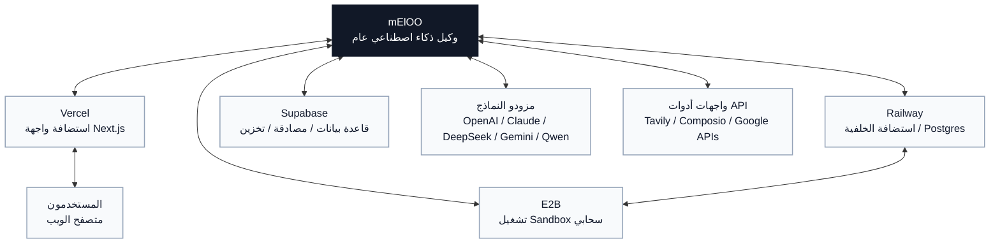

# Neloo

[English](../../README.md) | [简体中文](./README.zh-CN.md) | [Español](./README.es.md) | [العربية](./README.ar.md) | [Bahasa Indonesia](./README.id.md) | [Português](./README.pt-BR.md)

Neloo مساحة عمل لوكيل ذكاء اصطناعي عام. يستخدم الواجهة الأمامية Next.js والواجهة الخلفية LangGraph / Deep Agents. يدعم تنفيذ المهام عبر المحادثة، واستدعاء الأدوات، وسير عمل الملفات، وتنفيذ الكود، وإنشاء العروض التقديمية، وسير عمل الصور، وأدوات السيرة الذاتية، وتكاملات التطبيقات الخارجية.

بدأ المشروع كأداة لتحليل البيانات، لذلك ما زالت بعض معرفات graph الداخلية تستخدم الاسم التاريخي `data_analyst`. الاتجاه الحالي هو وكيل عام.

## الميزات

- محادثة وكيل عام مبنية على LangGraph و Deep Agents.
- دعم عدة مزودي نماذج عبر APIs أصلية أو متوافقة مع OpenAI.
- استدعاء أدوات، وكلاء فرعيون، خطوات موافقة بشرية، وعرض artifacts.
- رفع ملفات، تنزيل ملفات مولدة، وتخزين اختياري عبر Supabase.
- تنفيذ كود عبر E2B أو Docker أو subprocess محلي.
- بحث ويب عبر Tavily.
- تكاملات اختيارية عبر Composio.
- سير عمل للعروض، الصور، الترجمة، والسير الذاتية.
- وضع محلي مجهول للتطوير بدون تسجيل دخول إلزامي.

## خريطة التكاملات

يقع Neloo في مركز عدة تكاملات اختيارية. اضبط فقط الخدمات التي تحتاجها في النشر الخاص بك.



## البدء السريع

### الخلفية

```bash
cd backend
cp .env.example .env
python -m venv .venv
source .venv/bin/activate
pip install -e .
```

عدّل `backend/.env` وأضف مفتاح نموذج واحد على الأقل:

```env
SANDBOX_MODE=local
DEEPSEEK_API_KEY=your-key
```

ثم شغّل:

```bash
langgraph dev --host 127.0.0.1 --port 2024
```

### الواجهة الأمامية

```bash
cd frontend
cp .env.example .env.local
yarn install
yarn dev
```

افتح [http://localhost:3000](http://localhost:3000). إذا كان المنفذ مشغولاً:

```bash
yarn next dev --turbopack --port 3001
```

## الإعدادات

استخدم `backend/.env.example` و `frontend/.env.example` كقوالب. لا ترفع ملفات `.env` الحقيقية إلى Git.

راجع [دليل الإعداد الكامل](../configuration.md) لتفاصيل Supabase و Railway و E2B ونماذج المحادثة ومفاتيح الصور ومتغيرات الإنتاج.

`neloo-configurator/` مساعد إعداد لأدوات البرمجة الخارجية المدعومة بالذكاء الاصطناعي. لا يقوم وكيل Neloo بتحميله أثناء التشغيل. يمكن لأدوات مثل Codex/Copilot/Cursor اكتشافه عبر `.agents/skills/neloo-configurator/`، ويمكن لـ Claude Code اكتشافه عبر `.claude/skills/neloo-configurator/`.

يبدأ الإعداد اليدوي من:

```bash
cp backend/.env.example backend/.env
cp frontend/.env.example frontend/.env.local
```

### متغيرات الخلفية

| المجال | المتغيرات | ملاحظات |
| --- | --- | --- |
| الخادم | `PORT`, `API_BASE_URL`, `FRONTEND_URL`, `CORS_ALLOWED_ORIGINS` | عناوين النشر و CORS. |
| LangGraph | `LANGGRAPH_API_URL`, `LANGGRAPH_INTERNAL_URL`, `LANGGRAPH_DEFAULT_GRAPH_ID` | المعرف الافتراضي الحالي هو `data_analyst`. |
| النماذج | `DEEPSEEK_API_KEY`, `QWEN_API_KEY`, `MINIMAX_API_KEY`, `ANTHROPIC_API_KEY`, `OPENROUTER_API_KEY`, `OPENAI_API_KEY`, `ZHIPU_API_KEY`, `NEWAPI_API_KEY`, `TUZI_API_KEY` | اضبط واحداً أو أكثر. |
| Sandbox | `SANDBOX_MODE`, `E2B_API_KEY` | استخدم `local` فقط مع مدخلات موثوقة. للإنتاج استخدم `e2b` أو `docker`. |
| Supabase | `SUPABASE_URL`, `SUPABASE_SERVICE_KEY`, `SUPABASE_JWT_SECRET`, `SUPABASE_DB_HOST`, `SUPABASE_DB_PASSWORD` | مفتاح service role سرّ خاص بالخلفية فقط. |
| الاستمرارية | `DATABASE_URL` | مطلوب لحفظ checkpoints وسجل المحادثات. |
| التكاملات | `TAVILY_API_KEY`, `COMPOSIO_API_KEY`, `LANGSMITH_API_KEY` | خدمات اختيارية. |

### متغيرات الواجهة

| المجال | المتغيرات | ملاحظات |
| --- | --- | --- |
| اتصال الخلفية | `NEXT_PUBLIC_API_URL`, `NEXT_PUBLIC_ASSISTANT_ID` | يحدد عنوان الخلفية. |
| Supabase | `NEXT_PUBLIC_SUPABASE_URL`, `NEXT_PUBLIC_SUPABASE_ANON_KEY` | قيم عامة؛ اضبط سياسات RLS جيداً. |
| Google Drive | `NEXT_PUBLIC_GOOGLE_CLIENT_ID`, `NEXT_PUBLIC_GOOGLE_API_KEY` | قيم عامة؛ قيّد النطاقات و referrers. |
| نماذج من المتصفح | `NEXT_PUBLIC_TUZI_API_KEY`, `NEXT_PUBLIC_TUZI_IMAGE_API_KEY`, `NEXT_PUBLIC_DEEPSEEK_API_KEY`, `NEXT_PUBLIC_QWEN_API_KEY` | تظهر في حزمة المتصفح. استخدمها محلياً فقط أو مع مفاتيح مقيدة. |
| الصور | `NANOBANANA_IMAGE_API_KEY`, `NEXT_PUBLIC_IMAGE_API_URL` | `NANOBANANA_IMAGE_API_KEY` متغير خادم. |

## Supabase

1. أنشئ مشروع Supabase.
2. ضع Project URL في `SUPABASE_URL` و `NEXT_PUBLIC_SUPABASE_URL`.
3. ضع service role key في `SUPABASE_SERVICE_KEY`.
4. ضع anon key في `NEXT_PUBLIC_SUPABASE_ANON_KEY`.
5. اضبط `SUPABASE_JWT_SECRET` إذا فعّلت تحقق JWT.
6. شغّل migrations من `backend/supabase/migrations/` و `supabase/migrations/`.
7. لأدوات MCP انسخ `backend/.mcp.example.json` إلى `backend/.mcp.json` وغير project ref.

## E2B

للتطوير المحلي:

```env
SANDBOX_MODE=local
```

للتنفيذ السحابي المعزول:

```env
SANDBOX_MODE=e2b
E2B_API_KEY=your-e2b-api-key
```

## Railway و Vercel

النشر المقترح:

- الخلفية على Railway أو أي منصة حاويات.
- الواجهة على Vercel.
- قاعدة البيانات عبر Railway Postgres أو Supabase Postgres باستخدام `DATABASE_URL`.
- التخزين عبر Supabase Storage أو القرص المحلي للتطوير.

## الأمان قبل النشر المفتوح

- غيّر أي مفتاح ظهر سابقاً في Git.
- لا تنشر `.env` أو `.env.local` أو `.env.production` أو `.mcp.json` أو `.vercel/`.
- كل قيمة `NEXT_PUBLIC_*` عامة.
- مفاتيح service role يجب أن تبقى في الخلفية فقط.
- شغّل ماسح أسرار:

```bash
gitleaks detect --source . --verbose
```

إذا كان التاريخ يحتوي أسراراً، انشر من تاريخ نظيف أو مستودع جديد بعد تغيير المفاتيح.

## الرخصة

MIT License.
