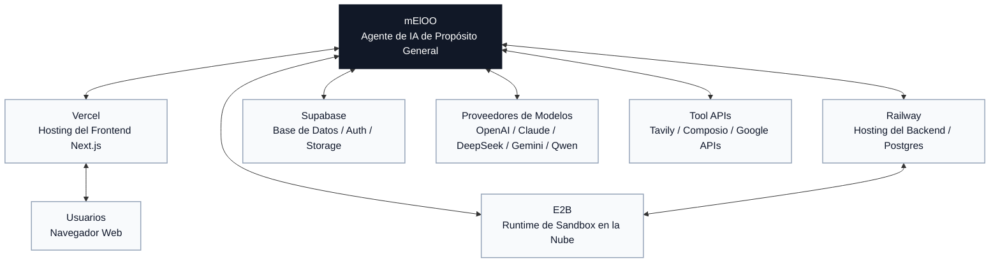

# Neloo

[English](../../README.md) | [简体中文](./README.zh-CN.md) | [Español](./README.es.md) | [العربية](./README.ar.md) | [Bahasa Indonesia](./README.id.md) | [Português](./README.pt-BR.md)

Neloo es un espacio de trabajo para agentes de IA de propósito general. Usa un frontend en Next.js y un backend con LangGraph / Deep Agents. Está pensado para ejecutar tareas por chat, usar herramientas, trabajar con archivos, ejecutar código, crear presentaciones, trabajar con imágenes, procesar currículos e integrar aplicaciones externas.

El proyecto comenzó como una herramienta de análisis de datos, por eso algunos identificadores internos todavía usan el nombre histórico `data_analyst`. La dirección actual del producto es un agente general.

## Funciones

- Chat con un agente general basado en LangGraph y Deep Agents.
- Múltiples proveedores de modelos mediante APIs nativas y compatibles con OpenAI.
- Llamadas a herramientas, subagentes, pasos con aprobación humana y renderizado de artifacts.
- Carga de archivos, descarga de archivos generados y almacenamiento opcional con Supabase.
- Ejecución de código mediante E2B, Docker o subprocess local.
- Búsqueda web con Tavily.
- Integraciones opcionales con Composio.
- Flujos para presentaciones, imágenes, traducción y currículos.
- Modo local anónimo para desarrollo sin inicio de sesión obligatorio.

## Mapa de Integraciones

Neloo se ubica en el centro de varias integraciones opcionales. Configura solo los servicios que necesites para tu despliegue.



## Inicio rápido

### Backend

```bash
cd backend
cp .env.example .env
python -m venv .venv
source .venv/bin/activate
pip install -e .
```

Edita `backend/.env` y configura al menos una clave de modelo:

```env
SANDBOX_MODE=local
DEEPSEEK_API_KEY=your-key
```

Ejecuta:

```bash
langgraph dev --host 127.0.0.1 --port 2024
```

### Frontend

```bash
cd frontend
cp .env.example .env.local
yarn install
yarn dev
```

Abre [http://localhost:3000](http://localhost:3000). Si el puerto está ocupado:

```bash
yarn next dev --turbopack --port 3001
```

## Configuración

Usa `backend/.env.example` y `frontend/.env.example` como plantillas. No subas archivos `.env` reales.

Consulta [la guía completa de configuración](../configuration.md) para Supabase, Railway, E2B, modelos de chat, claves de imagen y variables de producción.

`neloo-configurator/` es un asistente de configuración para herramientas externas de programación con IA. No lo carga el agente Neloo en runtime. Herramientas tipo Codex/Copilot/Cursor pueden descubrirlo mediante `.agents/skills/neloo-configurator/`, y Claude Code mediante `.claude/skills/neloo-configurator/`.

La configuración manual empieza con:

```bash
cp backend/.env.example backend/.env
cp frontend/.env.example frontend/.env.local
```

### Backend

| Área | Variables | Notas |
| --- | --- | --- |
| Servidor | `PORT`, `API_BASE_URL`, `FRONTEND_URL`, `CORS_ALLOWED_ORIGINS` | URLs de despliegue y CORS. |
| LangGraph | `LANGGRAPH_API_URL`, `LANGGRAPH_INTERNAL_URL`, `LANGGRAPH_DEFAULT_GRAPH_ID` | El graph por defecto sigue siendo `data_analyst`. |
| Modelos | `DEEPSEEK_API_KEY`, `QWEN_API_KEY`, `MINIMAX_API_KEY`, `ANTHROPIC_API_KEY`, `OPENROUTER_API_KEY`, `OPENAI_API_KEY`, `ZHIPU_API_KEY`, `NEWAPI_API_KEY`, `TUZI_API_KEY` | Configura uno o más. |
| Sandbox | `SANDBOX_MODE`, `E2B_API_KEY` | Usa `local` solo con entradas confiables. En producción usa `e2b` o `docker`. |
| Supabase | `SUPABASE_URL`, `SUPABASE_SERVICE_KEY`, `SUPABASE_JWT_SECRET`, `SUPABASE_DB_HOST`, `SUPABASE_DB_PASSWORD` | La service role key es solo para backend. |
| Persistencia | `DATABASE_URL` | Necesaria para checkpoints duraderos e historial. |
| Integraciones | `TAVILY_API_KEY`, `COMPOSIO_API_KEY`, `LANGSMITH_API_KEY` | Servicios opcionales. |

### Frontend

| Área | Variables | Notas |
| --- | --- | --- |
| Backend | `NEXT_PUBLIC_API_URL`, `NEXT_PUBLIC_ASSISTANT_ID` | Conexión al backend. |
| Supabase | `NEXT_PUBLIC_SUPABASE_URL`, `NEXT_PUBLIC_SUPABASE_ANON_KEY` | Valores públicos; configura RLS correctamente. |
| Google Drive | `NEXT_PUBLIC_GOOGLE_CLIENT_ID`, `NEXT_PUBLIC_GOOGLE_API_KEY` | Valores públicos; limita dominios y referrers. |
| Modelos en cliente | `NEXT_PUBLIC_TUZI_API_KEY`, `NEXT_PUBLIC_TUZI_IMAGE_API_KEY`, `NEXT_PUBLIC_DEEPSEEK_API_KEY`, `NEXT_PUBLIC_QWEN_API_KEY` | Se exponen en el navegador. Úsalos solo en desarrollo local o con claves muy restringidas. |
| Imágenes | `NANOBANANA_IMAGE_API_KEY`, `NEXT_PUBLIC_IMAGE_API_URL` | `NANOBANANA_IMAGE_API_KEY` es del lado servidor. |

## Supabase

1. Crea un proyecto en Supabase.
2. Usa el Project URL en `SUPABASE_URL` y `NEXT_PUBLIC_SUPABASE_URL`.
3. Pon la service role key en `SUPABASE_SERVICE_KEY`.
4. Pon la anon key en `NEXT_PUBLIC_SUPABASE_ANON_KEY`.
5. Configura `SUPABASE_JWT_SECRET` si activas verificación de JWT.
6. Ejecuta las migraciones de `backend/supabase/migrations/` y `supabase/migrations/`.
7. Para MCP, copia `backend/.mcp.example.json` a `backend/.mcp.json` y cambia el project ref.

## E2B

Para desarrollo local:

```env
SANDBOX_MODE=local
```

Para ejecución aislada en la nube:

```env
SANDBOX_MODE=e2b
E2B_API_KEY=your-e2b-api-key
```

## Railway y Vercel

Despliegue recomendado:

- Backend en Railway u otra plataforma de contenedores.
- Frontend en Vercel.
- Base de datos con Railway Postgres o Supabase Postgres mediante `DATABASE_URL`.
- Storage con Supabase Storage o disco local para desarrollo.

## Seguridad antes de publicar

- Rota cualquier clave que haya estado en Git.
- No publiques `.env`, `.env.local`, `.env.production`, `.mcp.json`, `.vercel/` ni datos locales.
- Todo `NEXT_PUBLIC_*` es público.
- Las claves de service role solo deben vivir en backend.
- Ejecuta un escáner de secretos:

```bash
gitleaks detect --source . --verbose
```

Si el historial contiene secretos, publica desde un historial limpio o desde un repositorio nuevo después de rotar credenciales.

## Licencia

MIT License. Consulta [LICENSE](../../LICENSE).
