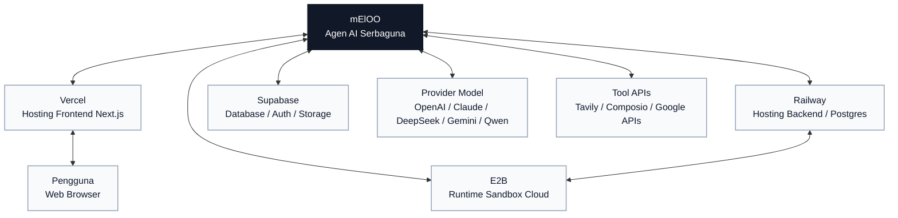

# Neloo

[English](../../README.md) | [简体中文](./README.zh-CN.md) | [Español](./README.es.md) | [العربية](./README.ar.md) | [Bahasa Indonesia](./README.id.md) | [Português](./README.pt-BR.md)

Neloo adalah workspace agen AI serbaguna dengan frontend Next.js dan backend LangGraph / Deep Agents. Proyek ini mendukung eksekusi tugas lewat chat, pemanggilan tool, alur kerja file, eksekusi kode, pembuatan presentasi, alur gambar, utilitas resume, dan integrasi aplikasi pihak ketiga.

Proyek ini awalnya berfokus pada analisis data, jadi beberapa graph ID internal masih memakai nama historis `data_analyst`. Arah produk saat ini adalah agen umum.

## Fitur

- Chat agen umum berbasis LangGraph dan Deep Agents.
- Banyak provider model melalui API native dan OpenAI-compatible.
- Tool calling, sub-agent, human-in-the-loop, dan rendering artifact.
- Upload file, download file hasil, dan penyimpanan opsional dengan Supabase.
- Eksekusi kode melalui E2B, Docker, atau subprocess lokal.
- Web search melalui Tavily.
- Integrasi opsional dengan Composio.
- Workflow presentasi, gambar, terjemahan, dan resume.
- Mode lokal anonim untuk pengembangan tanpa login wajib.

## Peta Integrasi

Neloo berada di pusat beberapa integrasi platform opsional. Konfigurasikan hanya layanan yang dibutuhkan untuk deployment kamu.



## Quick Start

### Backend

```bash
cd backend
cp .env.example .env
python -m venv .venv
source .venv/bin/activate
pip install -e .
```

Edit `backend/.env` dan set minimal satu model key:

```env
SANDBOX_MODE=local
DEEPSEEK_API_KEY=your-key
```

Jalankan:

```bash
langgraph dev --host 127.0.0.1 --port 2024
```

`backend/langgraph.json` default ditujukan untuk development lokal dan tidak memerlukan `DATABASE_URL`. Riwayat lokal dapat bersifat sementara jika persistence production tidak dikonfigurasi.

### Frontend

```bash
cd frontend
cp .env.example .env.local
yarn install
yarn dev
```

Gunakan Yarn 1.x untuk frontend; `frontend/yarn.lock` adalah lockfile kanonis repositori.

Buka [http://localhost:3000](http://localhost:3000). Jika port dipakai:

```bash
yarn next dev --turbopack --port 3001
```

## Konfigurasi

Gunakan `backend/.env.example` dan `frontend/.env.example` sebagai template. Jangan commit file `.env` asli.

Lihat [panduan konfigurasi lengkap](../configuration.md) untuk Supabase, Railway, E2B, model chat, key image generation, dan variabel production.

`neloo-configurator/` adalah asisten konfigurasi untuk tool coding AI eksternal. Direktori ini tidak dimuat oleh runtime agent Neloo. Tool seperti Codex/Copilot/Cursor dapat menemukannya lewat `.agents/skills/neloo-configurator/`, dan Claude Code lewat `.claude/skills/neloo-configurator/`.

Konfigurasi manual dimulai dengan:

```bash
cp backend/.env.example backend/.env
cp frontend/.env.example frontend/.env.local
```

### Backend

| Area | Variabel | Catatan |
| --- | --- | --- |
| Server | `PORT`, `API_BASE_URL`, `FRONTEND_URL`, `CORS_ALLOWED_ORIGINS` | URL deployment dan CORS. |
| LangGraph | `LANGGRAPH_API_URL`, `LANGGRAPH_INTERNAL_URL`, `LANGGRAPH_DEFAULT_GRAPH_ID` | Graph default masih `data_analyst`. |
| Model | `DEEPSEEK_API_KEY`, `QWEN_API_KEY`, `MINIMAX_API_KEY`, `ANTHROPIC_API_KEY`, `OPENAI_API_KEY`, `GEMINI_API_KEY`, `ZHIPU_API_KEY`, `OPENROUTER_API_KEY`, `CUSTOM_OPENAI_API_KEY`, `CUSTOM_ANTHROPIC_API_KEY` | Set satu atau lebih; selector menampilkan satu entri per provider. |
| Nama model dan endpoint | Variabel `*_MODEL` dan `*_BASE_URL`, misalnya `QWEN_MODEL`, `QWEN_BASE_URL`, `OPENAI_MODEL`, `GEMINI_BASE_URL` | Pilih model dan gateway. `NEWAPI_*` dan `TUZI_*` tetap didukung. |
| Sandbox | `SANDBOX_MODE`, `E2B_API_KEY` | `local` hanya untuk input tepercaya. Produksi sebaiknya `e2b` atau `docker`. |
| Supabase | `SUPABASE_URL`, `SUPABASE_SERVICE_KEY`, `SUPABASE_JWT_SECRET`, `SUPABASE_DB_HOST`, `SUPABASE_DB_PASSWORD` | Service role key hanya untuk backend. |
| Persistensi | `DATABASE_URL` | Tidak diperlukan oleh `backend/langgraph.json` lokal. Wajib untuk persistence production dengan `backend/langgraph.production.json`. |
| Integrasi | `TAVILY_API_KEY`, `COMPOSIO_API_KEY`, `LANGSMITH_API_KEY` | Layanan opsional. |

### Frontend

| Area | Variabel | Catatan |
| --- | --- | --- |
| Backend | `NEXT_PUBLIC_API_URL`, `NEXT_PUBLIC_ASSISTANT_ID` | Koneksi ke backend. |
| Supabase | `NEXT_PUBLIC_SUPABASE_URL`, `NEXT_PUBLIC_SUPABASE_ANON_KEY` | Nilai publik; konfigurasikan RLS dengan benar. |
| Google Drive | `NEXT_PUBLIC_GOOGLE_CLIENT_ID`, `NEXT_PUBLIC_GOOGLE_API_KEY` | Nilai publik; batasi origin dan referrer. |
| Model client-side | `NEXT_PUBLIC_TUZI_API_KEY`, `NEXT_PUBLIC_TUZI_IMAGE_API_KEY`, `NEXT_PUBLIC_DEEPSEEK_API_KEY`, `NEXT_PUBLIC_QWEN_API_KEY` | Terekspos di browser. Gunakan hanya untuk lokal atau key yang dibatasi ketat. |
| Gambar | `NANOBANANA_IMAGE_API_KEY`, `NEXT_PUBLIC_IMAGE_API_URL` | `NANOBANANA_IMAGE_API_KEY` adalah server-side. |

## Supabase

1. Buat proyek Supabase.
2. Masukkan Project URL ke `SUPABASE_URL` dan `NEXT_PUBLIC_SUPABASE_URL`.
3. Masukkan service role key ke `SUPABASE_SERVICE_KEY`.
4. Masukkan anon key ke `NEXT_PUBLIC_SUPABASE_ANON_KEY`.
5. Set `SUPABASE_JWT_SECRET` jika memakai verifikasi JWT.
6. Jalankan migrasi dari `backend/supabase/migrations/` dan `supabase/migrations/`.
7. Untuk MCP, salin `backend/.mcp.example.json` ke `backend/.mcp.json` dan ganti project ref.

## E2B

Untuk pengembangan lokal:

```env
SANDBOX_MODE=local
```

Untuk eksekusi cloud yang terisolasi:

```env
SANDBOX_MODE=e2b
E2B_API_KEY=your-e2b-api-key
```

## Railway dan Vercel

Deployment yang disarankan:

- Backend di Railway atau platform container lain.
- Frontend di Vercel.
- Persistence production memakai `backend/langgraph.production.json` dan Railway Postgres atau Supabase Postgres lewat `DATABASE_URL`.
- Storage memakai Supabase Storage atau disk lokal untuk development.

## Keamanan Sebelum Open Source

- Rotasi semua key yang pernah masuk Git.
- Jangan publish `.env`, `.env.local`, `.env.production`, `.mcp.json`, `.vercel/`, atau data lokal.
- Semua `NEXT_PUBLIC_*` adalah publik.
- Service role key hanya boleh ada di backend.
- Jalankan secret scanner:

```bash
gitleaks detect --source . --verbose
```

Jika histori Git mengandung secret, publish dari histori bersih atau repo baru setelah rotasi kredensial.

## Lisensi

MIT License. Lihat [LICENSE](../../LICENSE).
