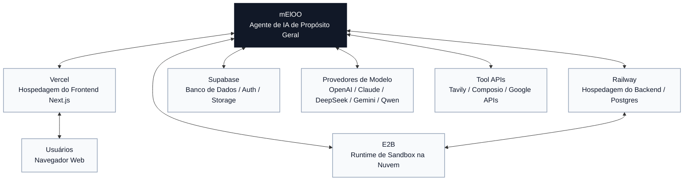

# Neloo

[English](../../README.md) | [简体中文](./README.zh-CN.md) | [Español](./README.es.md) | [العربية](./README.ar.md) | [Bahasa Indonesia](./README.id.md) | [Português](./README.pt-BR.md)

Neloo é um workspace de agente de IA de propósito geral, construído com frontend em Next.js e backend em LangGraph / Deep Agents. Ele foi criado para execução de tarefas por chat, uso de ferramentas, fluxos de arquivos, execução de código, geração de apresentações, fluxos de imagem, utilitários de currículo e integrações com aplicativos externos.

O projeto começou com foco em análise de dados, por isso alguns IDs internos de graph ainda usam o nome histórico `data_analyst`. A direção atual é um agente geral.

## Recursos

- Chat de agente geral com LangGraph e Deep Agents.
- Vários provedores de modelo por APIs nativas e compatíveis com OpenAI.
- Tool calling, subagentes, etapas com aprovação humana e renderização de artifacts.
- Upload de arquivos, download de arquivos gerados e armazenamento opcional com Supabase.
- Execução de código via E2B, Docker ou subprocess local.
- Busca web com Tavily.
- Integrações opcionais com Composio.
- Workflows de apresentações, imagens, tradução e currículos.
- Modo local anônimo para desenvolvimento sem login obrigatório.

## Mapa de Integrações

Neloo fica no centro de várias integrações opcionais. Configure apenas os serviços necessários para o seu deploy.



## Início Rápido

### Backend

```bash
cd backend
cp .env.example .env
python -m venv .venv
source .venv/bin/activate
pip install -e .
```

Edite `backend/.env` e configure pelo menos uma chave de modelo:

```env
SANDBOX_MODE=local
DEEPSEEK_API_KEY=your-key
```

Execute:

```bash
langgraph dev --host 127.0.0.1 --port 2024
```

O `backend/langgraph.json` padrão é voltado para desenvolvimento local e não requer `DATABASE_URL`. O histórico local pode ser efêmero se a persistência de produção não for configurada.

### Frontend

```bash
cd frontend
cp .env.example .env.local
yarn install
yarn dev
```

Use Yarn 1.x no frontend; `frontend/yarn.lock` é o lockfile canônico do repositório.

Acesse [http://localhost:3000](http://localhost:3000). Se a porta estiver ocupada:

```bash
yarn next dev --turbopack --port 3001
```

## Configuração

Use `backend/.env.example` e `frontend/.env.example` como modelos. Não faça commit de arquivos `.env` reais.

Veja o [guia completo de configuração](../configuration.md) para Supabase, Railway, E2B, modelos de chat, chaves de imagem e variáveis de produção.

`neloo-configurator/` é um assistente de configuração para ferramentas externas de programação com IA. Ele não é carregado pelo agente Neloo em runtime. Ferramentas como Codex/Copilot/Cursor podem encontrá-lo via `.agents/skills/neloo-configurator/`, e Claude Code via `.claude/skills/neloo-configurator/`.

A configuração manual começa com:

```bash
cp backend/.env.example backend/.env
cp frontend/.env.example frontend/.env.local
```

### Backend

| Área | Variáveis | Observações |
| --- | --- | --- |
| Servidor | `PORT`, `API_BASE_URL`, `FRONTEND_URL`, `CORS_ALLOWED_ORIGINS` | URLs de deploy e CORS. |
| LangGraph | `LANGGRAPH_API_URL`, `LANGGRAPH_INTERNAL_URL`, `LANGGRAPH_DEFAULT_GRAPH_ID` | O graph padrão ainda é `data_analyst`. |
| Modelos | `DEEPSEEK_API_KEY`, `QWEN_API_KEY`, `MINIMAX_API_KEY`, `ANTHROPIC_API_KEY`, `OPENAI_API_KEY`, `GEMINI_API_KEY`, `ZHIPU_API_KEY`, `OPENROUTER_API_KEY`, `CUSTOM_OPENAI_API_KEY`, `CUSTOM_ANTHROPIC_API_KEY` | Configure um ou mais; o seletor mostra uma entrada por provedor. |
| Modelo e endpoint | Variáveis `*_MODEL` e `*_BASE_URL`, por exemplo `QWEN_MODEL`, `QWEN_BASE_URL`, `OPENAI_MODEL`, `GEMINI_BASE_URL` | Escolha o modelo exato e a URL do gateway. |
| Sandbox | `SANDBOX_MODE`, `E2B_API_KEY` | Use `local` apenas com entradas confiáveis. Em produção prefira `e2b` ou `docker`. |
| Supabase | `SUPABASE_URL`, `SUPABASE_SERVICE_KEY`, `SUPABASE_JWT_SECRET`, `SUPABASE_DB_HOST`, `SUPABASE_DB_PASSWORD` | Service role key é segredo apenas do backend. |
| Persistência | `DATABASE_URL` | Não é necessário para o `backend/langgraph.json` local. É obrigatório para persistência de produção com `backend/langgraph.production.json`. |
| Integrações | `TAVILY_API_KEY`, `COMPOSIO_API_KEY`, `LANGSMITH_API_KEY` | Serviços opcionais. |

### Frontend

| Área | Variáveis | Observações |
| --- | --- | --- |
| Backend | `NEXT_PUBLIC_API_URL`, `NEXT_PUBLIC_ASSISTANT_ID` | Conexão com o backend. |
| Supabase | `NEXT_PUBLIC_SUPABASE_URL`, `NEXT_PUBLIC_SUPABASE_ANON_KEY` | Valores públicos; configure RLS corretamente. |
| Google Drive | `NEXT_PUBLIC_GOOGLE_CLIENT_ID`, `NEXT_PUBLIC_GOOGLE_API_KEY` | Valores públicos; restrinja origins e referrers. |
| Imagens | `NANOBANANA_IMAGE_API_KEY`, `NANOBANANA_IMAGE_BASE_URL`, `OPENAI_API_KEY`, `OPENAI_IMAGE_MODEL` | `NANOBANANA_IMAGE_API_KEY` é server-side. |

## Supabase

1. Crie um projeto Supabase.
2. Use o Project URL em `SUPABASE_URL` e `NEXT_PUBLIC_SUPABASE_URL`.
3. Coloque a service role key em `SUPABASE_SERVICE_KEY`.
4. Coloque a anon key em `NEXT_PUBLIC_SUPABASE_ANON_KEY`.
5. Configure `SUPABASE_JWT_SECRET` se usar verificação de JWT.
6. Rode as migrações em `backend/supabase/migrations/` e `supabase/migrations/`.
7. Para MCP, copie `backend/.mcp.example.json` para `backend/.mcp.json` e troque o project ref.

## E2B

Para desenvolvimento local:

```env
SANDBOX_MODE=local
```

Para execução isolada na nuvem:

```env
SANDBOX_MODE=e2b
E2B_API_KEY=your-e2b-api-key
```

## Railway e Vercel

Deploy recomendado:

- Backend no Railway ou em outra plataforma de containers.
- Frontend na Vercel.
- Persistência de produção com `backend/langgraph.production.json` e Railway Postgres ou Supabase Postgres via `DATABASE_URL`.
- Storage com Supabase Storage ou disco local para desenvolvimento.

## Segurança Antes de Abrir o Código

- Rotacione qualquer chave que já tenha aparecido no Git.
- Não publique `.env`, `.env.local`, `.env.production`, `.mcp.json`, `.vercel/` ou dados locais.
- Todo `NEXT_PUBLIC_*` é público.
- Service role keys devem ficar apenas no backend.
- Rode um scanner de segredos:

```bash
gitleaks detect --source . --verbose
```

Se o histórico do Git contiver segredos, publique a partir de um histórico limpo ou de um novo repositório depois de rotacionar as credenciais.

## Licença

MIT License. Veja [LICENSE](../../LICENSE).
