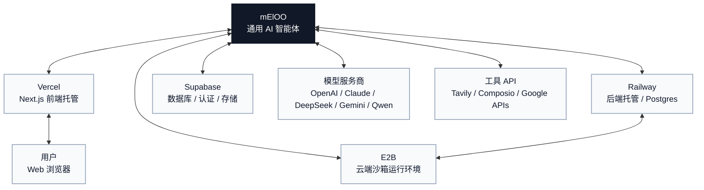

# Neloo

[English](../../README.md) | [简体中文](./README.zh-CN.md) | [Español](./README.es.md) | [العربية](./README.ar.md) | [Bahasa Indonesia](./README.id.md) | [Português](./README.pt-BR.md)

Neloo 是一个通用 AI 智能体工作台，由 Next.js 前端和 LangGraph / Deep Agents 后端组成。它支持对话式任务执行、工具调用、文件流程、代码执行、演示文稿生成、图像工作流、简历工具和第三方应用集成。

这个项目最早从数据分析场景开始，因此内部仍有一些历史 graph ID 叫 `data_analyst`。现在的产品定位是通用智能体。

## 功能

- 基于 LangGraph 和 Deep Agents 的通用智能体对话。
- 支持多个模型服务商，包括原生 API 和 OpenAI-compatible API。
- 支持工具调用、子智能体、人工确认流程和 artifact 渲染。
- 支持文件上传、生成文件下载，以及可选的 Supabase 存储。
- 支持 E2B、Docker 或本地子进程代码执行。
- 支持 Tavily 网页搜索。
- 可选 Composio 第三方应用集成。
- 包含演示文稿、图像、翻译和简历相关工作流。
- 本地开发默认可使用匿名访客模式，不强制登录。

## 集成关系图

Neloo 位于多个可选平台集成的中心。部署时只需要配置你实际启用的服务。



## 快速开始

### 后端

```bash
cd backend
cp .env.example .env
python -m venv .venv
source .venv/bin/activate
pip install -e .
```

编辑 `backend/.env`，至少配置一个模型 API key。本地开发可以先使用：

```env
SANDBOX_MODE=local
DEEPSEEK_API_KEY=your-key
```

启动后端：

```bash
langgraph dev --host 127.0.0.1 --port 2024
```

### 前端

```bash
cd frontend
cp .env.example .env.local
yarn install
yarn dev
```

默认访问 [http://localhost:3000](http://localhost:3000)。如果 `3000` 被占用，可以运行：

```bash
yarn next dev --turbopack --port 3001
```

## 环境变量

以 `backend/.env.example` 和 `frontend/.env.example` 为准，不要提交真实 `.env` 文件。

### 后端配置

| 类型 | 变量 | 说明 |
| --- | --- | --- |
| 服务地址 | `PORT`, `API_BASE_URL`, `FRONTEND_URL`, `CORS_ALLOWED_ORIGINS` | 部署地址、回调地址和跨域配置。 |
| LangGraph | `LANGGRAPH_API_URL`, `LANGGRAPH_INTERNAL_URL`, `LANGGRAPH_DEFAULT_GRAPH_ID` | 默认 graph ID 目前仍是 `data_analyst`。 |
| 模型服务 | `DEEPSEEK_API_KEY`, `QWEN_API_KEY`, `MINIMAX_API_KEY`, `ANTHROPIC_API_KEY`, `OPENROUTER_API_KEY`, `OPENAI_API_KEY`, `ZHIPU_API_KEY`, `NEWAPI_API_KEY`, `TUZI_API_KEY` | 至少配置一个。 |
| 模型网关地址 | `QWEN_BASE_URL`, `MINIMAX_BASE_URL`, `MINIMAX_ANTHROPIC_BASE_URL`, `ANTHROPIC_BASE_URL`, `OPENROUTER_BASE_URL`, `ZHIPU_BASE_URL`, `NEWAPI_BASE_URL`, `NEWAPI_ANTHROPIC_BASE_URL`, `TUZI_BASE_URL`, `TUZI_ANTHROPIC_BASE_URL` | 用于兼容不同模型网关。 |
| 沙箱 | `SANDBOX_MODE`, `E2B_API_KEY` | 本地可信开发可用 `local`，生产建议 `e2b` 或 `docker`。 |
| Supabase | `SUPABASE_URL`, `SUPABASE_SERVICE_KEY`, `SUPABASE_JWT_SECRET`, `SUPABASE_DB_HOST`, `SUPABASE_DB_PASSWORD` | service role key 只能放在后端。 |
| 持久化 | `DATABASE_URL` | Railway Postgres 通常自动提供；用于 LangGraph checkpoint 和历史会话。 |
| 文件/图片签名 | `FILE_SECRET_KEY`, `IMAGE_SECRET_KEY`, `FILE_USE_LOCAL_STORAGE`, `IMAGE_USE_LOCAL_STORAGE` | 生产环境要使用稳定随机密钥。 |
| 集成 | `TAVILY_API_KEY`, `COMPOSIO_API_KEY`, `LANGSMITH_API_KEY` | 可选能力。 |

### 前端配置

| 类型 | 变量 | 说明 |
| --- | --- | --- |
| 后端连接 | `NEXT_PUBLIC_API_URL`, `NEXT_PUBLIC_ASSISTANT_ID` | 指向 LangGraph/FastAPI 后端。 |
| Supabase 浏览器端 | `NEXT_PUBLIC_SUPABASE_URL`, `NEXT_PUBLIC_SUPABASE_ANON_KEY` | 公开值，但仍要正确配置 RLS 策略。 |
| Google Drive | `NEXT_PUBLIC_GOOGLE_CLIENT_ID`, `NEXT_PUBLIC_GOOGLE_API_KEY` | 公开值，要限制来源域名和 OAuth origins。 |
| 前端直连模型 | `NEXT_PUBLIC_TUZI_API_KEY`, `NEXT_PUBLIC_TUZI_IMAGE_API_KEY`, `NEXT_PUBLIC_DEEPSEEK_API_KEY`, `NEXT_PUBLIC_QWEN_API_KEY` | 会暴露在浏览器 bundle 中，只适合本地开发或受限 key。生产建议改成后端代理。 |
| 图片 API | `NANOBANANA_IMAGE_API_KEY`, `NEXT_PUBLIC_IMAGE_API_URL` | `NANOBANANA_IMAGE_API_KEY` 是 Next.js API route 的服务端变量。 |

## Supabase 配置

1. 创建 Supabase 项目。
2. 将 Project URL 填入 `SUPABASE_URL` 和 `NEXT_PUBLIC_SUPABASE_URL`。
3. 将 service role key 填入 `SUPABASE_SERVICE_KEY`，不要放到前端。
4. 将 anon key 填入 `NEXT_PUBLIC_SUPABASE_ANON_KEY`。
5. 如需校验真实登录 JWT，配置 `SUPABASE_JWT_SECRET`。
6. 在 Supabase SQL Editor 中执行 `backend/supabase/migrations/` 和 `supabase/migrations/` 下的迁移。
7. 如需 MCP 工具，复制 `backend/.mcp.example.json` 为 `backend/.mcp.json` 并替换项目 ref。

## E2B 配置

本地开发可以先用：

```env
SANDBOX_MODE=local
```

这种模式会在本机执行代码，只能用于可信输入。云端隔离执行使用：

```env
SANDBOX_MODE=e2b
E2B_API_KEY=your-e2b-api-key
```

E2B 模板配置位于 `e2b.toml`、`e2b.Dockerfile` 和 `e2b-template/data-analyst-sandbox/`。

## Railway / Vercel

推荐部署方式：

- 后端部署到 Railway 或其它容器平台。
- 前端部署到 Vercel。
- 数据库使用 Railway Postgres 或 Supabase Postgres，并通过 `DATABASE_URL` 连接。
- 文件存储使用 Supabase Storage；本地开发可用本地磁盘。

Railway 后端通常需要：

```env
API_BASE_URL=https://your-backend.up.railway.app
FRONTEND_URL=https://your-frontend.vercel.app
CORS_ALLOWED_ORIGINS=https://your-frontend.vercel.app
DATABASE_URL=postgresql://...
SANDBOX_MODE=e2b
E2B_API_KEY=...
DEEPSEEK_API_KEY=...
SUPABASE_URL=...
SUPABASE_SERVICE_KEY=...
```

Vercel 前端通常需要：

```env
NEXT_PUBLIC_API_URL=https://your-backend.up.railway.app
NEXT_PUBLIC_ASSISTANT_ID=data_analyst
NEXT_PUBLIC_SUPABASE_URL=https://your-project.supabase.co
NEXT_PUBLIC_SUPABASE_ANON_KEY=...
```

## 开源前安全检查

- 任何曾经提交过的 key 都要轮换，即使当前代码已经删除。
- 不要发布 `.env`、`.env.local`、`.env.production`、`.mcp.json`、`.vercel/`、Supabase temp 目录或本地数据库。
- 所有 `NEXT_PUBLIC_*` 都是公开值，不能放 service role key 或无限制模型 key。
- Google 和 Supabase 的浏览器端 key 要在控制台限制来源。
- 生产环境的付费模型 API 建议通过后端代理调用。
- 发布前运行密钥扫描：

```bash
gitleaks detect --source . --verbose
```

如果当前 Git 历史里曾经包含私密信息，建议先轮换凭证，然后用清理后的历史或新仓库发布。

## 许可证

MIT License。若仓库包含独立 LICENSE 文件，以该文件为准。
